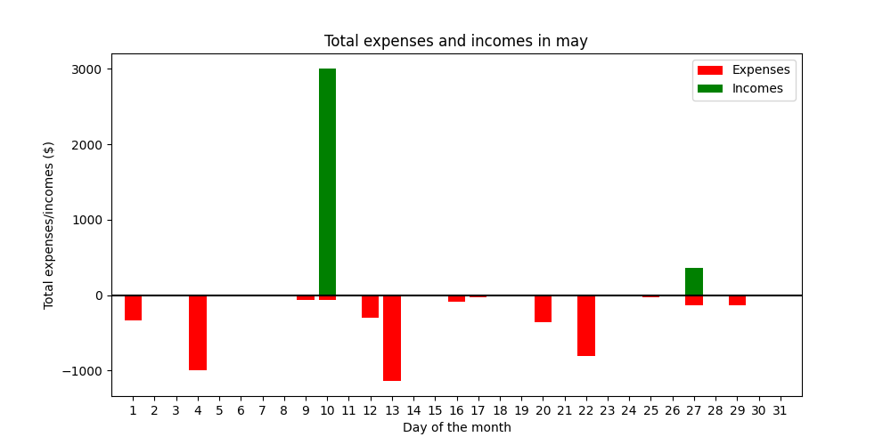

# Finance Manager App

> [!NOTE]
> Finance Manager App is still under developement, find my email address at the bottom for more info!

## About
Finance Manager App is a finance tracker desktop application that allows users to
easily manage their expenses and incomes. It provides clear analytics and visual representations
of users financial operations. Below I listed main functionalities:
* track incomes and expenses
* store data in mySQL database
* perform financial analysis based on stored expenses/incomes
* view graphical visualization of expensess/incomes
* give hints to the user based on his financial behaviour to better his saving skills
  
## Used technologies:
* SQLalchemy
* mySQL
* unittest
* logging
* argsparser
  
## Instalation
1. Clone this repository: `git clone https://github.com/dominikcedro/FinanceManagerApp.git`
2. Navigate to the project directory: `cd FinanceManagerApp`
3. Install the required packages: `pip install -r requirements.txt`
4. Update the database credentials in `source/database/database_config.json`
5. Feel free to use '-h' or '--help' commands to understand the program better.

## Usage
This app is run with argsparser commands.
Commands should be ran from FinanceManager directory.
Below I listed all possible commands in use.

### test_db_connection 
Checks if connection to database is successful  
Input:
```sh
python -m source.main test_db_connection
```
Output:
```sh
test_db_connection successful
```

### list_operations 
Shows all operations, it has parameters --order --limit --direction  
Input:
```sh
python -m source.main list_operations --order date --limit 5 --direction ASC
```
Output:
```sh                                             
List operations
order: date, limit: 5, direction: ASC

Salary for April - 2024-05-10 12:06:33 - income - Salary - 6000.0
Gym membership - 2024-05-12 08:00:10 - expense - Sports - 300.0
Groceries at shop2 - 2024-05-12 10:11:00 - expense - Groceries - 112.08
Groceries at shop1 - 2024-05-12 10:12:00 - expense - Groceries - 150.0
Dinner for Two - 2024-05-16 16:11:00 - expense - Takeout - 82.56
```

### list_categories 
Shows all categories, it has parameter --limit 
Input:
```sh
python -m source.main list_categories --limit 5 
```
Output:
```sh                                                                 
List categories

Housing - Expenses/incomes regarding housing (repairs, maintenance)
Salary - Payment - monthly
Sports - Any payments related to sports
Groceries - Groceries at the local shop
Takeout - Food ordered via apps / phone
```

### add_opp 
Adds new financial operation to database
Input:
```sh
python -m source.main add_op "Car Rental" "2024-05-29 18:32:10" "expense" "Travel" 129.99     
```

Output:
```sh
Added new operation: 
Car Rental - 2024-05-29 18:32:10 - expense - Travel - Tickets and other expenses related to traveling. - 129.99

```
### add_cat 
Adds new category to database
Input:
```sh
python -m source.main add_cat "Pets" "Financial operations related to pet keeping"
```
Output:
```sh
Added new category: 
Pets - Financial operations related to pet keeping

```

### analyze_all 
Shows general analysis results for all financial operations in databse
Input:
```sh
python -m source.main analyze_all
```
Output:
```sh
Analyze all results:
Total of all expenses: 2803.71
Average of all expenses: 200.27
Total of all incomes: 3359.99
Average of all incomes: 1679.99
```

### analyze_by_category 
Shows analysis based on specified category

```sh
python -m source.main analyze_by_category "Groceries" 
```
Output:
```sh
Analyze by category results: 
total of all expenses for category Groceries: 726.99
average of all expenses Groceries: 181.7475
total of all incomes Groceries: 0.0
average of all incomes Groceries: 0.0
```

### visualize_total_month 
Shows total expenses and incomes in set month

```sh
python -m source.main visualize_total_month "May"
```
Output:




## Contributing
Contributions are welcome! Please feel free to submit a pull request or create an issue.

## License
This project is licensed under the terms of the BSD 3 license.

## Contact
If you have any questions or comments about this project, please feel free to email me at dominikcedro00@gmail.com.

original author: Dominik Marcel Cedro  
creation date: 17.03.2024  
latest version: Alpha - 09.06.2024
